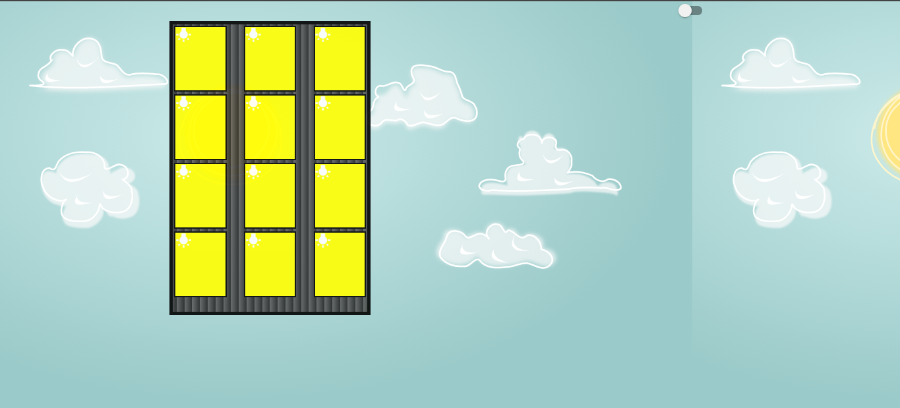
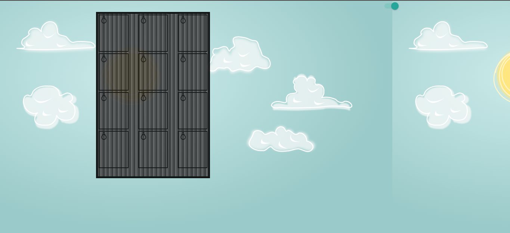
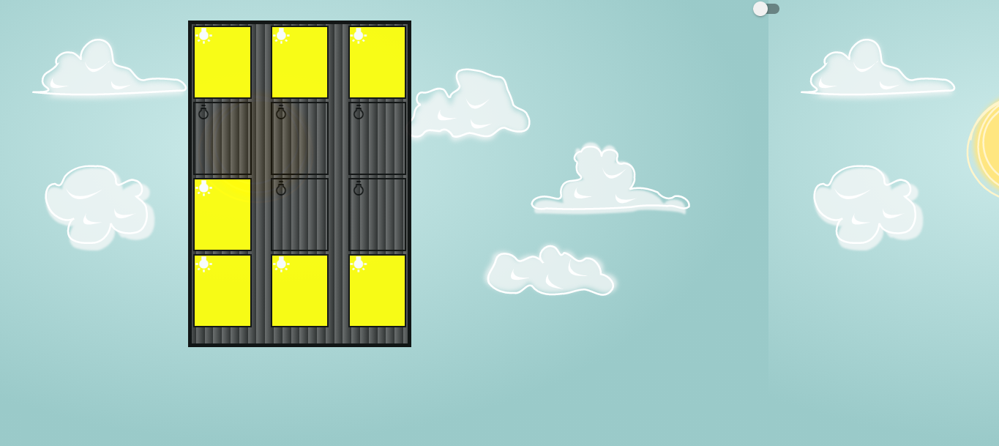
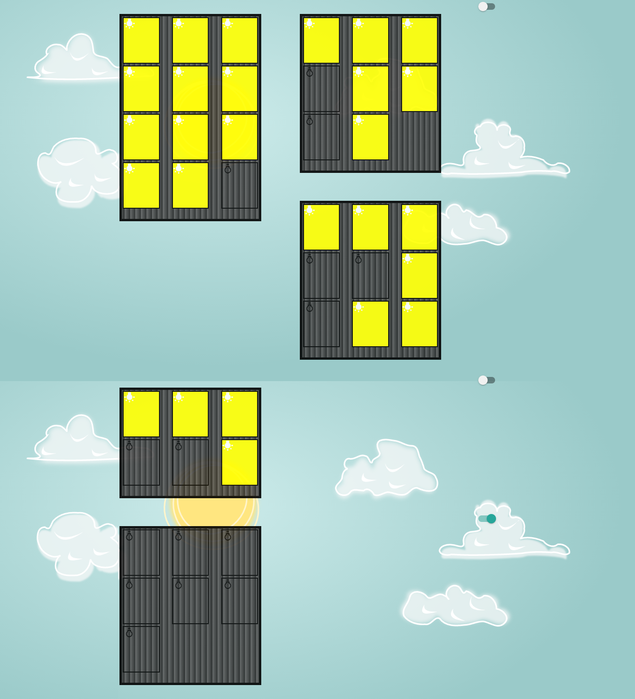
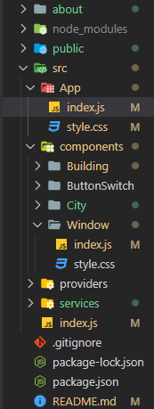
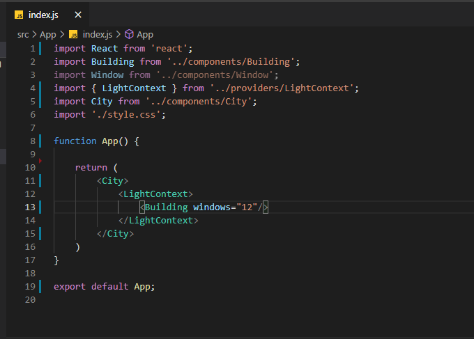
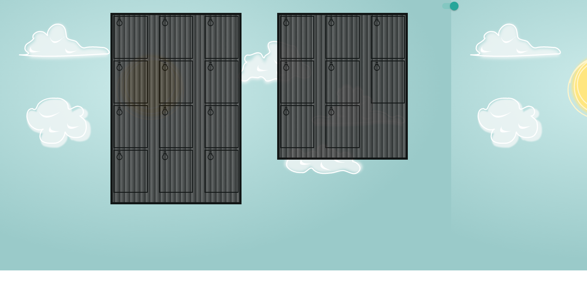
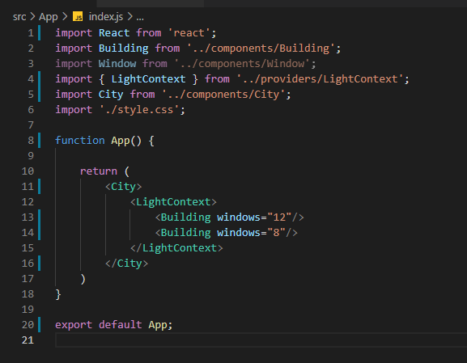
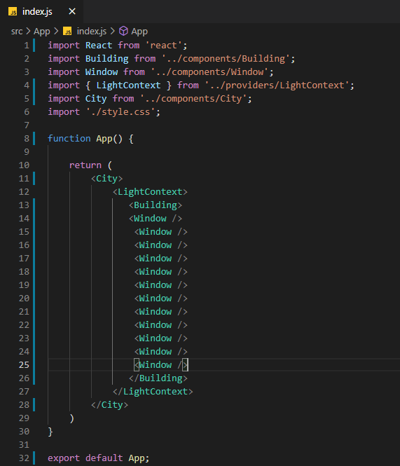

<h1 align="center"><strong>Desafio Estágio</strong></h1>

# Sobre o Projeto

#### Primeiro desafio para a vaga de estágio 

<br/>
<br/>

# Pré-requisitos

* Você precisa ter instalado em sua máquina o sistema de controle de versões distribuído [GIT](https://git-scm.com/)
* Você precisa ter instalado em sua máquina o gerenciador de dependêcias [NPM](https://www.npmjs.com/get-npm)
* Você precisa ter instalado em sua máquina o [NODEJS](https://nodejs.org/pt-br/)
* Você precisa ter uma conexão com a internet

<br/>
<br/>

# Instalação e Execução

<b>1. Execute o comando pelo seu terminal:</b>

```
git clone https://github.com/GALSANTA/iEngDesafio1
```
<b>2. Mude no seu terminal para a pasta do projeto:</b>

```
cd iEngDesafio1
```

<b>3. Na pasta do projeto execute o comando:</b>

```
npm install
```

<b>4. Depois de terminar a instalação das dependências rode o seguinte comando no cmd: </b>

```
npm start
```

---

<br/>
<br/>


# Algumas coisas interessante do projeto

* ## A primeira é o contexto da luz, podemos apagar todas as luzes do prédio através do botão do contexto.
<br/>


<br/>
<br/>

* ## A Segunda é o que cada janela é independente, podemos apagar a luz apenas clicando em cada uma.
<br>

<br/>
<br/>

* ## A Terceira é a escalabilidade, em alguma momento podemos querer não só um prédio com 12 janelas, mas sim 5 prédios com número de janelas totalmente diferentes e com 3 com mesmo contexto de luz e outros 2 totalmente independentes.
<br>

<br/>
<br/>


<br/>
<br/>

# Como criar sua cidade

* ## Primeiro temos que achar o arquivo que manipula tudo na aplicação que é o arquivo index.js que fica dentro da pasta App. Segue imagem.
<br>

<br/>
<br/>

* ## Dentro deste arquivo você irá um código igual ao da imagem logo a abaixo. Nele podemos observar na linha 13 o componente que representa o prédio (Building) e o parâmetro com o número de janelas (windows). 
<br/>

<br/>
<br/>

* ## Além disso na linha 12 pode-se observar o contexto de luz no qual o prédio está contido, ou seja, para que os prédios tenham o mesmo contexto de luz, devem está contidos no mesmo componente LightContext, como as imagens abaixo sugerem.
<br/>


<br/>
<br/>

* ## Com isso já da para ter uma base de como construir sua cidade com prédios, mas se por acaso você construir outro componente e quiser coloca-lo no prédio, você pode gerenciar as janelas colocando o componente da janela (Window) dentro do componente do prédio (Building). O resultado das imagens abaixo é o mesmo.

<br/>



<br/>
<br/>


# Tecnologias utilizadas

* [Materialize](https://materializecss.com/getting-started.html) - Framework CSS
* [NPM](https://www.npmjs.com/get-npm) - dependency manager
* [GIT BASH](https://git-scm.com/) - control version system
* [GITHUB ](https://github.com/)
* [SUNSET API](https://sunrise-sunset.org/api) - Sunset Sunrise API
* [Node.js](https://nodejs.org/en/) - JavaScript runtime


<br/>
<br/>

# Author

* **Fernando Marques**  - [GALSANTA](https://github.com/GALSANTA)
